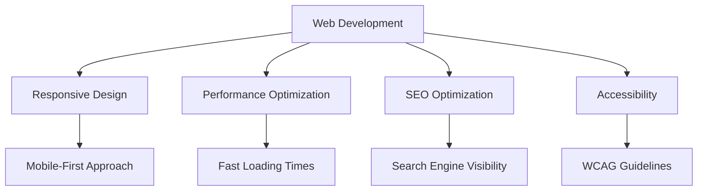

# Hi there! 👋 I'm Pobitra Dolai

  

  

---

## 🚀 About Me

I'm a passionate full-stack developer with expertise in React.js, dedicated to creating amazing web experiences!

- 🔭 I'm currently working on **self-study projects** to enhance my skills
- 🌱 I'm constantly learning and improving my **React.js** expertise
- 💬 Ask me about **React, JavaScript, or anything web-related**
- 📫 How to reach me: [LinkedIn](https://www.linkedin.com/in/pobitra-dolai-214524289?utm_source=share&utm_campaign=share_via&utm_content=profile&utm_medium=android_app)
- 😄 Pronouns: **He/Him**
- ⚡ Fun fact: I love turning complex problems into simple, beautiful solutions!

---

## 🛠️ Technologies & Tools

### Frontend

### Backend

### Database

### Deployment & Tools

---

## 🎯 Featured Projects

| Project | Description | Tech Stack | Link |
|---------|-------------|------------|------|
| **Sahajpath Career Solution** | Modern career solution platform with React.js | React.js, JavaScript, CSS | [View Project](https://github.com/pobitradolai/sahajpath.git) |
| **Achiever Solution Education** | Complete education platform with frontend & backend | React.js, Node.js, MySQL | [Frontend](https://github.com/pobitradolai/fornt-end-achiver-real.git) \| [Backend](https://github.com/pobitradolai/sqlconnection-achiver.git) |
| **Frontend Showcase** | Portfolio showcasing frontend skills | HTML, CSS, JavaScript | [View Project](https://github.com/pobitradolai/case-study-pobitra) |

---

## ✨ Key Features I Implement

### 🎨 Frontend Excellence
- ✅ **Next.js & React.js** - Modern server-side rendering and static generation
- ✅ **Responsive Design** - Optimal viewing across all devices
- ✅ **Cross-Browser Compatibility** - Works on Chrome, Firefox, Safari, Edge
- ✅ **Performance Optimization** - Fast loading and smooth interactions

### 🔧 Backend & Database Mastery
- ✅ **Node.js & Express** - Robust server-side applications
- ✅ **MS SQL Server** - Enterprise-grade database solutions
- ✅ **RESTful APIs** - Clean and efficient data communication
- ✅ **Database Optimization** - Query performance and indexing

### 🏷️ Specialized Technologies
- ✅ **RFID Systems** - Radio frequency identification integration
- ✅ **Barcode Scanning** - Real-time barcode reading and processing
- ✅ **QR Code Generation** - Dynamic QR code creation and scanning
- ✅ **Hardware Integration** - Seamless software-hardware communication

### 🚀 Deployment & DevOps
- ✅ **IIS Server** - Windows server deployment and configuration
- ✅ **Version Control** - Git workflow mastery
- ✅ **CI/CD** - Automated testing and deployment
- ✅ **Security** - Best practices for data protection

---

## 📊 GitHub Statistics

  
  

  

  

---

## 🤝 Let's Connect!

  

---

  

  <h3>💼 "Turning ideas into reality, one line of code at a time!" 💼</h3>

